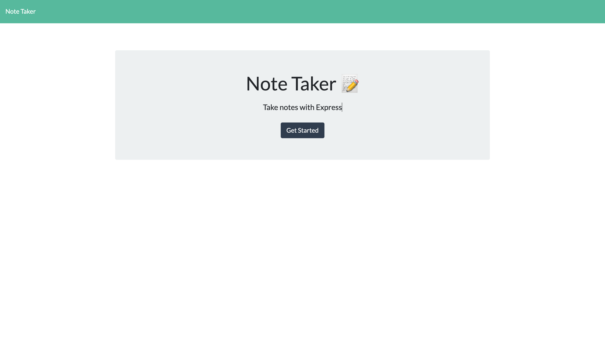
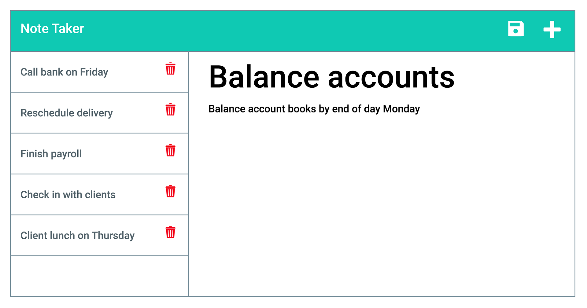

# Note Taker

[](https://opensource.org/licenses/ISC)




## Description
An application used to help the user create their own notes to keep track of important data or helps to keep track of daily tasks.

## User Story

```
AS A small business owner
I WANT to be able to write and save notes
SO THAT I can organize my thoughts and keep track of tasks I need to complete
```

## Acceptance Criteria

```
GIVEN a note-taking application
WHEN I open the Note Taker
THEN I am presented with a landing page with a link to a notes page
WHEN I click on the link to the notes page
THEN I am presented with a page with existing notes listed in the left-hand column, plus empty fields to enter a new note title and the note’s text in the right-hand column
WHEN I enter a new note title and the note’s text
THEN a Save icon appears in the navigation at the top of the page
WHEN I click on the Save icon
THEN the new note I have entered is saved and appears in the left-hand column with the other existing notes
WHEN I click on an existing note in the list in the left-hand column
THEN that note appears in the right-hand column
WHEN I click on the Write icon in the navigation at the top of the page
THEN I am presented with empty fields to enter a new note title and the note’s text in the right-hand column
```

## Table of Contents
* [Description](#description)
* [Installation](#installation)
* [Usage](#usage)
* [Contributing](#contributing)
* [License](#license)

## Installation
Run the command inside the terminal `npm i`, then run in the command inside the terminal `node server.js`

## Usage
Creating notes as reminders for tasks that will help the user keep track of.

## License
This project is under the the ISC license.

## Questions
* [Github](https://github.com/Ricky22M)
* I am reachable at rmedina2004@outlook.com for any additonal questions you may have.